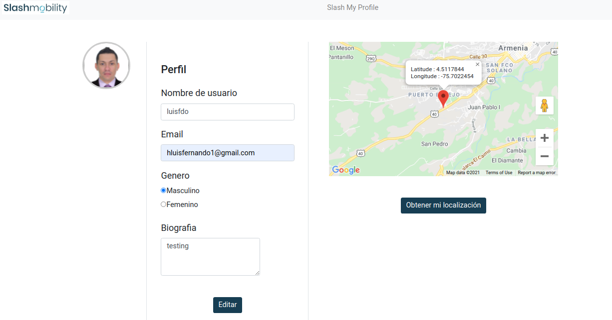

# Slash profile Frontend-Angular

This project contains the visual layer of the scope of the exercise, here you as a user register your profile or update it and through the google maps api obtain your coordinates

## Build Project

`npm install`
## Run Project

`ng serve`

  
# visual presentation

you could run the frontend side in the url `http://localhost:4200/`